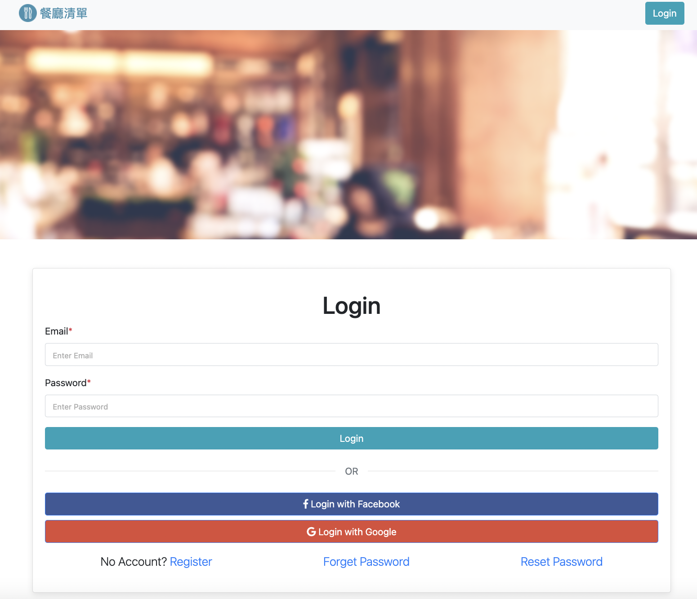

# 我的餐廳清單



## 介紹

紀錄屬於自己的餐廳清單，可以在此網站上擁有自己的帳號管理餐廳名單，並且能夠瀏覽餐廳、查看詳細資訊、甚至連結到地圖。

### 功能

- 查看所有餐廳
- 瀏覽餐廳的詳細資訊
- 連結餐廳的地址到 Google 地圖
- 搜尋特定餐廳
- 新增餐廳
- 編輯餐廳
- 刪除餐廳
- 登入與登出
- 註冊帳號
- 可用 Facebook 登入
- 可用 Google 登入
- 使用者忘記密碼可以寄送隨機產生的密碼給使用者
- 使用者可以重設密碼

## 開始使用

1. 請先確認有安裝 node.js 與 npm
2. 將專案 clone 到本地
3. 在本地開啟之後，透過終端機進入資料夾，輸入：

   ```bash
   npm install
   ```

4. 安裝完畢後，繼續輸入：

   ```bash
   npm run dev
   ```

5. 若看見此行訊息則代表順利運行，打開瀏覽器進入到以下網址

   ```bash
   Listening on http://localhost:3000
   ```

6. 建立種子使用者資料
   ```bash
   npm run seed
   ```
8. 測試種子資料
Markdown | Less | Pretty
--- | --- | ---
*Still* | `renders` | **nicely**
1 | 2 | 3

7. 若欲暫停使用

   ```bash
   ctrl + c
   ```

## 開發工具

- node.js 14.18.0
- express 4.17.3
- express-Handlebars 3.0.0
- bootstrap 4.3.1
- font-awesome 5.8.1
- passport 0.5.2
- passport-local 3.0.0
- passport-facebook 3.0.0
- bcryptjs 2.4.3

- MongoDB
- mongoose 6.0.5